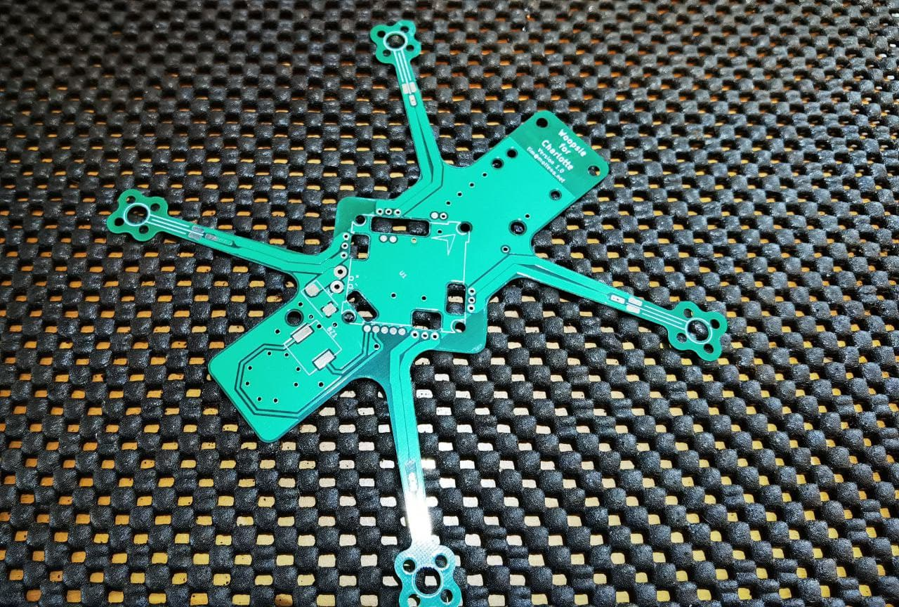

# whoopsie
A small open-source flying 18650 quadcopter.

## Required Components

* [Flywoo Robo 1202.5 11500kv motors](https://flywoo.net/products/flywoo-robo-rb1202-5-5500kv-11500kv-1-5mm-shaft-fpv-motor)
* [Happymodel ELRS all-in-one flight controller](http://www.happymodel.cn/index.php/2021/05/19/happymodel-elrs-f4-2g4-aio-5in1-flight-controller-built-in-spi-2-4ghz-elrs-rx/)
* Caddx ant (or similar)
* PCB and 3D printed frame

## Directories

* `/pcb/` contains the KiCAD layout, with the custom library for the motors and AIO board
* `/frame/` contains the FreeCAD file.

## TODO in v2 

* Modify the 3D printed frame to sit below the PCB, with the battery inset into the frame
* Update the camera mount
* Add a self-powered/charging buzzer to the PCB
* (?) Board-mounted RX if we go for a longer one 

## Gallery

